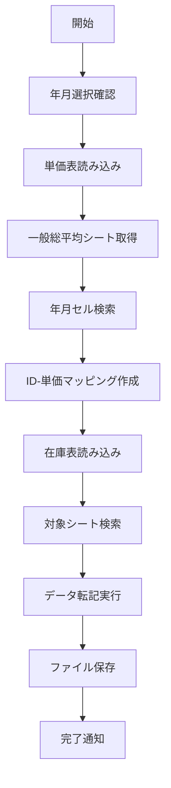
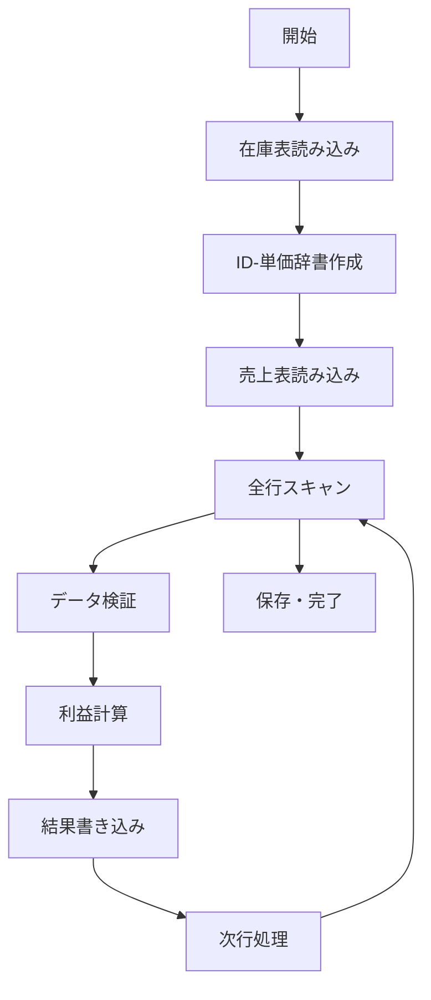

# 在庫単価転記アプリ 配布版説明書

## 📋 アプリケーション概要

「在庫単価転記アプリ」は、Excel形式の単価表・在庫表・売上分析表間でのデータ転記と利益計算を自動化するWindows向けアプリケーションです。

### 🎯 主な機能
- **単価表から在庫表への自動転記**：月別単価データの一括転記
- **売上表での利益計算**：在庫単価を基にした利益・利益率の自動計算
- **柔軟な設定機能**：ファイルパスやExcel行・列番号のカスタマイズ
- **進捗表示**：処理状況のリアルタイム表示

---

## 💻 システム要件

### 必要環境
- **OS**: Windows 10 以降
- **メモリ**: 最小 4GB RAM（8GB 推奨）
- **ストレージ**: 100MB 以上の空き容量
- **Excel**: Microsoft Excel 2007以降（.xlsxファイル対応）

### 対応ファイル形式
- **入力**: Excel (.xlsx) ファイルのみ
- **出力**: 既存Excelファイルへの上書き保存

---

## 📁 配布パッケージ構成

```
📦 在庫単価転記アプリ_配布版/
├── 📄 在庫単価転記アプリ.exe          # アプリケーション本体
├── 📄 settings.json                   # 設定ファイル（初回起動時作成）
```

---

## 🚀 インストールと起動

### インストール手順
1. **配布ZIPファイルをダウンロード**
2. **任意のフォルダに解凍**
3. **`在庫単価転記アプリ.exe`をダブルクリックで起動**

### ⚠️ 重要な注意事項
- **Excelファイルは事前に閉じてください**
- **ファイルを読み書き可能な場所に配置してください**
- **ウイルス対策ソフトの除外設定が必要な場合があります**

---

## 📊 対応Excelファイル仕様

### 1. 単価表ファイル（例：フロンガス単価表2025.xlsx）

#### 必須シート
- **シート名**: 「一般総平均」

#### データ構造
```
     A    B    C    D    E    F    ...
1         202501 202502 202503 ...     ← 年月データ（YYYYMM形式）
2         
3   ID01  ID02   ID03   ID04   ...     ← 商品ID行（設定可能：デフォルト3行目）
4   
...
25  単価1 単価2  単価3  単価4  ...     ← 単価行（設定可能：デフォルト25行目）
```

#### 仕様詳細
- **年月形式**: YYYYMM（例：202501 = 2025年1月）
- **ID行**: 商品識別コードを配置
- **単価行**: 対応する商品の単価を配置
- **データ範囲**: B列以降（A列は除く）

### 2. 在庫表ファイル（例：2025在庫.xlsx）

#### シート命名規則
- **シート名**: 年月を含む名前（例：「202501在庫」「2025年1月在庫」）
- **検索方法**: シート名に「YYYYMM」が含まれているかで判定

#### データ構造
```
     A    B    C     D    E    ...   J     ...
1    項目1 項目2 商品ID 項目4 ...   単価  ...
2    
...
7    data1 data2 ID01  data4 ...   price1 ...  ← データ開始行（設定可能：デフォルト7行目）
8    data1 data2 ID02  data4 ...   price2 ...
9    data1 data2 ID03  data4 ...   price3 ...
```

#### 仕様詳細
- **商品ID列**: C列（設定可能：デフォルト3列目）
- **単価列**: J列（設定可能：デフォルト10列目）
- **データ開始行**: 7行目（設定可能）

### 3. 売上分析表ファイル（例：R706 得意先別売上分析表.xlsx）

#### データ構造
```
     A    B    C    D     E    F     G    H     I     J       ...
1    項目1 項目2 項目3 商品ID 項目5 売上額 項目7 売上数量 利益  利益率  ...
2    data1 data2 data3 ID01  data5 sales7 data7 salesnum profit profit_rate
3    data1 data2 data3 ID02  data5 sales7 data7 salesnum profit profit_rate
```

#### 仕様詳細
- **商品ID列**: D列（設定可能：デフォルト4列目）
- **売上金額列**: F列（設定可能：デフォルト6列目）
- **売上数量列**: H列（設定可能：デフォルト8列目）
- **利益列**: I列（設定可能：デフォルト9列目）- 計算結果出力
- **利益率列**: J列（設定可能：デフォルト10列目）- 計算結果出力

---

## 🖥️ アプリケーション操作方法

### メイン画面

#### 画面構成
```
┌─────────────────────────────┐
│ [設定]                      │ ← 設定ボタン
├─────────────────────────────┤
│ [2025年▼] [8月▼]           │ ← 年月選択
├─────────────────────────────┤
│ [在庫単価を在庫表に転記]    │ ← 機能1ボタン
│ [在庫単価を売上表に転記]    │ ← 機能2ボタン
├─────────────────────────────┤
│ ████████████░░░ 65%         │ ← 進捗バー
├─────────────────────────────┤
│ 処理中: 1250/2000行         │ ← ステータス表示
└─────────────────────────────┘
```

### 基本操作手順

#### STEP 1: 年月選択
1. **対象年月を選択**
   - 年ドロップダウン：処理対象の年を選択
   - 月ドロップダウン：処理対象の月を選択
   - デフォルト：現在の年月

#### STEP 2: 在庫単価転記
1. **「在庫単価を在庫表に転記」ボタンをクリック**
2. **処理実行**
   - 単価表から選択年月のデータを取得
   - 商品ID と単価のマッピングを作成
   - 在庫表の対応行に単価を転記
3. **進捗確認**
   - プログレスバーで処理状況を表示
   - 50行ごとに進捗更新
4. **完了通知**
   - 「◯件の価格を更新しました」メッセージ表示

#### STEP 3: 売上表利益計算
1. **「在庫単価を売上表に転記」ボタンをクリック**
   - ⚠️ 事前に在庫単価転記を実行してください
2. **処理実行**
   - 在庫表から商品ID と単価を取得
   - 売上表の各行で利益計算実行
   - 計算式：利益 = 売上金額 - (売上数量 × 単価)
   - 利益率 = 利益 ÷ 売上金額
3. **進捗確認**
   - 100行ごとに進捗更新
4. **完了通知**
   - 「◯件の売上データを更新しました」メッセージ表示

---

## ⚙️ 設定機能詳細

### 設定画面の開き方
1. メイン画面の「設定」ボタンをクリック
2. 設定ウィンドウが最前面で表示
3. スクロール可能なインターフェース

### ファイル設定

#### 各ファイルの設定項目
| 項目 | 説明 | デフォルト値 |
|------|------|-------------|
| 単価表 | 単価データが格納されたExcelファイル | フロンガス単価表2025.xlsx |
| 在庫表 | 在庫データが格納されたExcelファイル | 2025在庫.xlsx |
| 売上表 | 売上分析データが格納されたExcelファイル | R706 得意先別売上分析表.xlsx |

#### ファイル設定の操作
- **参照ボタン**: ファイル選択ダイアログを開く
- **開くボタン**: 設定済みファイルの場所をエクスプローラで開く
- **×ボタン**: 設定されているパスをクリア

### 行・列設定

#### 単価表の設定
| 設定項目 | 説明 | デフォルト値 | 設定例 |
|----------|------|-------------|--------|
| ID 行 | 商品IDが記載されている行番号 | 3 | 商品コードの行 |
| 単価 行 | 単価が記載されている行番号 | 25 | 価格データの行 |

#### 在庫表の設定
| 設定項目 | 説明 | デフォルト値 | 設定例 |
|----------|------|-------------|--------|
| ID 列 | 商品IDが記載されている列番号 | 3 | C列 |
| 単価 列 | 単価を書き込む列番号 | 10 | J列 |
| データ開始 行 | データが始まる行番号 | 7 | ヘッダー除く最初のデータ行 |

#### 売上表の設定
| 設定項目 | 説明 | デフォルト値 | 設定例 |
|----------|------|-------------|--------|
| ID 列 | 商品IDが記載されている列番号 | 4 | D列 |
| 売上金額 列 | 売上金額が記載されている列番号 | 6 | F列 |
| 売上数量 列 | 売上数量が記載されている列番号 | 8 | H列 |
| 利益 列 | 利益を書き込む列番号 | 9 | I列 |
| 利益率 列 | 利益率を書き込む列番号 | 10 | J列 |

### 設定の保存・管理

#### 設定ファイル（settings.json）
```json
{
  "files": {
    "price_file_path": "フロンガス単価表2025.xlsx",
    "stock_file_path": "2025在庫.xlsx", 
    "sales_file_path": "R706 得意先別売上分析表.xlsx"
  },
  "positions": {
    "id_row_in_price": 3,
    "price_row_in_price": 25,
    "id_column_in_stock": 3,
    "price_column_in_stock": 10,
    "data_start_row_in_stock": 7,
    "id_column_in_sales": 4,
    "profit_column_in_sales": 9,
    "profit_rate_column_in_sales": 10,
    "sales_column_in_sales": 6,
    "sales_num_column_in_sales": 8
  }
}
```

#### 設定操作
- **設定を保存**: 現在の設定をJSONファイルに保存
- **設定をリセット**: 全設定をデフォルト値に戻す
- **自動保存**: アプリ終了時に現在の設定を保存

---

## 🔧 トラブルシューティング

### よくあるエラーと対処法

#### ❌ 「ファイルが見つかりません」
**原因**: 指定されたExcelファイルが存在しない  
**対処法**:
1. 設定画面で正しいファイルパスを設定
2. ファイルの存在確認
3. ファイル名の確認（大文字小文字含む）

#### ❌ 「ファイルが開かれています」
**原因**: ExcelやPowerBI等でファイルが開かれている  
**対処法**:
1. 対象Excelファイルを閉じる
2. Excelのプロセスを完全終了
3. ファイルの読み取り専用属性を解除

#### ❌ 「一般総平均シートが見つかりません」
**原因**: 単価表に「一般総平均」シートが存在しない  
**対処法**:
1. 単価表のシート名を「一般総平均」に変更
2. 正しい単価表ファイルを指定
3. シート名の確認（全角・半角・スペース含む）

#### ❌ 「◯◯のセルが見つかりません」
**原因**: 指定年月のデータが単価表に存在しない  
**対処法**:
1. 単価表の1行目に該当年月データ（YYYYMM）があるか確認
2. 年月選択が正しいか確認
3. データの形式確認（数値として入力されているか）

#### ❌ 「◯◯の在庫シートが見つかりません」
**原因**: 該当年月を含むシート名が在庫表に存在しない  
**対処法**:
1. 在庫表にYYYYMM形式を含むシート名があるか確認
2. シート名の修正（例：「202501在庫」「2025年1月」等）
3. 年月選択の確認

#### ❌ 「入力エラー」（設定画面）
**原因**: 行・列番号に不正な値を入力  
**対処法**:
1. 正の整数（1以上）を入力
2. 空欄を埋める
3. 文字や記号を削除

### パフォーマンス問題

#### 処理が遅い場合
- **ファイルサイズ確認**: 10MB以下推奨
- **データ量確認**: 10,000行以下推奨
- **メモリ使用量確認**: 他のアプリを終了
- **ウイルススキャン**: 一時的に除外設定

#### メモリ不足エラー
- **ファイル分割**: 大きなファイルを月別に分割
- **不要データ削除**: 使用しない列や行を削除
- **システム再起動**: メモリをクリア

---

## 📈 処理仕様詳細

### 在庫単価転記処理

#### 処理フロー


#### 詳細仕様
1. **年月文字列生成**: 「2025年1月」→「202501」
2. **セル検索範囲**: 単価表1行目の全列
3. **データ抽出範囲**: 対象月列～次月列（または最終列）
4. **転記条件**: IDと単価の両方が存在する場合のみ
5. **進捗更新**: 50行処理ごと
6. **エラーハンドリング**: 各段階での例外処理

### 売上表利益計算処理

#### 計算式
```
利益 = 売上金額 - (売上数量 × 在庫単価)
利益率 = 利益 ÷ 売上金額 × 100
```

#### 処理フロー


#### 詳細仕様
1. **データ検証**: 売上金額・数量・単価の数値チェック
2. **ゼロ除算対策**: 売上金額が0の場合はスキップ
3. **エラー処理**: 計算エラー行はログ出力してスキップ継続
4. **進捗更新**: 100行処理ごと
5. **精度**: 小数点以下は元データの精度を維持

---

## 🔒 セキュリティとデータ保護

### データ保護
- **バックアップ推奨**: 処理前に元ファイルをバックアップ
- **権限確認**: ファイルに読み書き権限があることを確認
- **同時アクセス回避**: 複数ユーザーでの同時使用禁止

### セキュリティ対策
- **外部通信なし**: インターネット接続は不要
- **ローカル処理**: すべての処理はローカルPC内で完結
- **機密情報**: 設定ファイル以外にデータは保存されません

---

## 📞 サポート情報

### 動作環境の確認方法
1. **Windowsバージョン**: `Win + R` → `winver` → Enter
2. **メモリ容量**: タスクマネージャー → パフォーマンス → メモリ
3. **Excel確認**: .xlsxファイルが開けることを確認

### ログの確認
- **アプリログ**: コンソール出力（コマンドプロンプトから実行時）
- **Windowsログ**: イベントビューアー → Windowsログ → Application

### 問題報告時の必要情報
1. **エラーメッセージの全文**
2. **使用環境**（OS、Excelバージョン）
3. **ファイル構造**（可能な範囲で）
4. **操作手順**（エラー発生まで）
5. **設定内容**（settings.jsonの内容）

---

## 📚 参考資料

### Excel列番号対応表
| 列番号 | Excel列 | 列番号 | Excel列 | 列番号 | Excel列 |
|--------|---------|--------|---------|--------|---------|
| 1 | A | 11 | K | 21 | U |
| 2 | B | 12 | L | 22 | V |
| 3 | C | 13 | M | 23 | W |
| 4 | D | 14 | N | 24 | X |
| 5 | E | 15 | O | 25 | Y |
| 6 | F | 16 | P | 26 | Z |
| 7 | G | 17 | Q | 27 | AA |
| 8 | H | 18 | R | 28 | AB |
| 9 | I | 19 | S | 29 | AC |
| 10 | J | 20 | T | 30 | AD |

### 年月形式例
| 表示 | YYYYMM形式 | 備考 |
|------|------------|------|
| 2025年1月 | 202501 | 1桁月は0埋め |
| 2025年12月 | 202512 | 2桁月はそのまま |
| 2024年9月 | 202409 | 前年も対応 |

---

## 📝 更新履歴

### Version 1.0.0 (2025年8月)
- 初回リリース
- 基本的な転記機能実装
- 設定機能実装
- エラーハンドリング強化

---

## 📄 ライセンス

このソフトウェアは内部使用目的で提供されています。
無断での複製・配布・改変を禁止します。

---

**🎯 本アプリケーションが業務効率化のお役に立てれば幸いです。**
**ご不明な点がございましたら、お気軽にお問い合わせください。**
